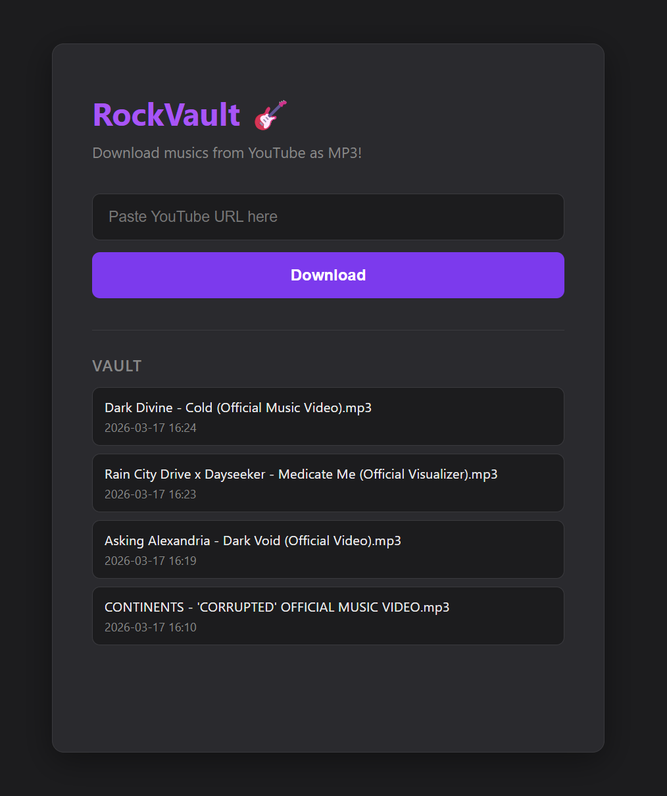

# 🎸 RockVault

A personal web app to download and back up rock music from YouTube as MP3 files.

Built as a learning project covering full-stack web development, HTTP fundamentals, and application security.



> ⚠️ **Disclaimer:** This application is intentionally not hardened for production.
> It is designed for local use only, as part of a hands-on security study —
> the goal is to identify and fix vulnerabilities deliberately left in the codebase.
> **Do not expose this app to the internet or deploy it in any public environment.**

---

## Tech Stack

- **Backend:** Python 3 + FastAPI
- **Downloader:** yt-dlp + FFmpeg
- **Database:** SQLite via SQLModel
- **Frontend:** HTML + CSS + JavaScript (vanilla)
- **Server:** Ubuntu Server 24 (headless)
- **Version Control:** Git + GitHub

---

## Project Status

| Phase | Description | Status |
|-------|-------------|--------|
| Phase 1 | FastAPI running, base structure | ✅ Done |
| Phase 2 | yt-dlp integration, download pipeline | ✅ Done |
| Phase 3 | Frontend UI connected to backend | ✅ Done |
| Phase 4 | HTTP deep dive, Swagger, logs | ⏳ Planned |
| Phase 5 | Security audit and hardening | ⏳ Planned |

---

## Features

- `POST /download` — Accepts a YouTube URL, downloads audio as MP3, serves directly to the browser, and deletes the file from the server automatically
- `GET /history` — Returns the full download history from the database
- `GET /health` — Health check endpoint
- `GET /docs` — Interactive API documentation (Swagger UI)

---

## How to Run Locally

### Requirements

- Python 3.11+
- FFmpeg installed on the system
- A Linux environment (tested on Ubuntu Server 24)

### Setup
```bash
# Clone the repository
git clone https://github.com/MSoares28/RockVault.git
cd RockVault

# Create and activate virtual environment
python3 -m venv .venv
source .venv/bin/activate

# Install dependencies
pip install -r requirements.txt

# Install FFmpeg (Ubuntu/Debian)
sudo apt install ffmpeg -y
```

### Configuration
```bash
# Copy the example config and set your server IP
cp frontend/config.example.js frontend/config.js
# Edit config.js and replace YOUR_SERVER_IP with your machine's IP
```

### Running
```bash
# Start the backend
uvicorn backend.main:app --host 0.0.0.0 --port 8000 --reload

# In a second terminal, serve the frontend
python3 -m http.server 4000 --directory frontend/
```

- API: `http://YOUR_SERVER_IP:8000`
- UI: `http://YOUR_SERVER_IP:4000`
- Swagger docs: `http://YOUR_SERVER_IP:8000/docs`

---

## Project Structure
```
RockVault/
├── backend/
│   ├── __init__.py
│   └── main.py
├── frontend/
│   ├── index.html
│   ├── script.js
│   ├── style.css
│   └── config.example.js
├── docs/
│   └── assets/
│       └── screenshot.png
├── requirements.txt
└── README.md
```

---

## Security Notes

This project is part of a structured learning path toward application security.
Known attack surfaces being studied include:

- **SSRF** — the `/download` endpoint accepts arbitrary URLs without validation
- **CORS misconfiguration** — currently set to `allow_origins=["*"]`
- **No authentication** — all endpoints are publicly accessible
- **Path traversal** — filename handling has not been hardened

These vulnerabilities will be documented and fixed in **Phase 5**, with full
write-ups in `docs/security-audit.md`.

## Roadmap

Phase 3 is complete and functional. Future improvements are being planned, including new features and quality-of-life enhancements.

Stay tuned. 🎸

---

## License

This project is for educational purposes only.